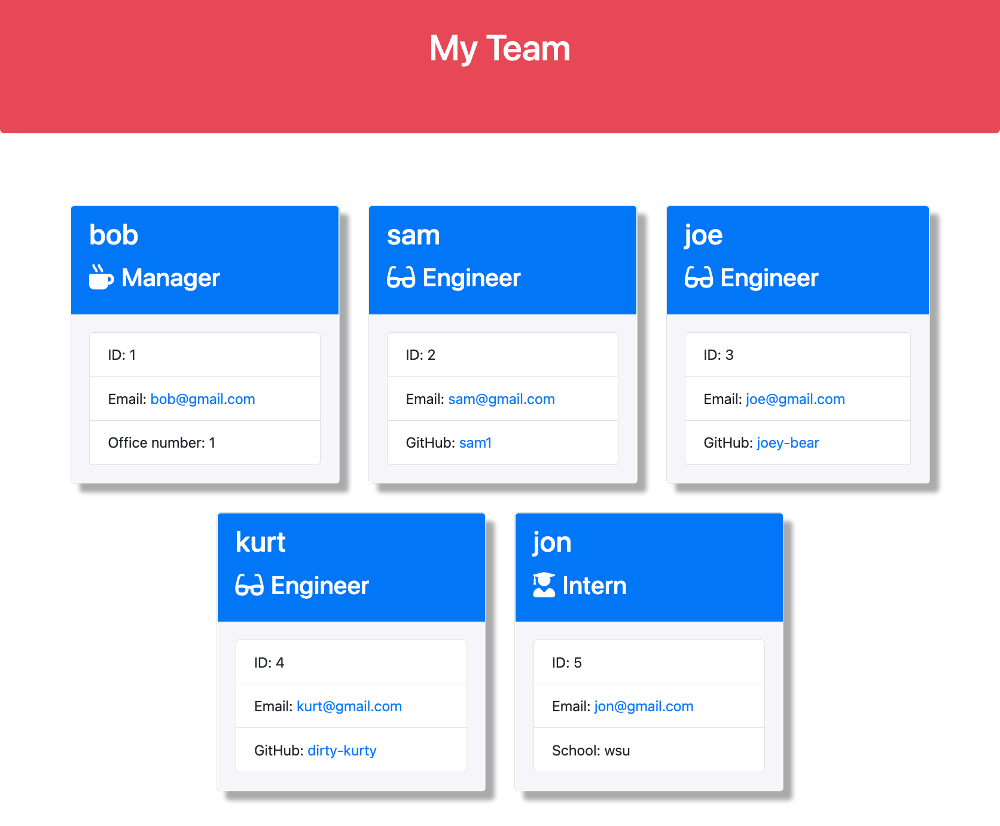

# Team Profile Generator

[](https://opensource.org/licenses/ISC)

## Description

This Node.js command-line application takes in information about employees on a software engineering team, then generates an HTML webpage that displays summaries for each person. I utilized [Inquirer](https://www.npmjs.com/package/inquirer) in working with the user's input, [Jest](https://www.npmjs.com/package/jest) for unit testing.

## Table of Contents

- [Installation](#installation)
- [Usage](#usage)
- [Product](#product)
- [Questions](#questions)
- [Technology](#technology)
- [License](#license)

## Installation

Prerequisites: Node and NPM

```bash
git clone https://github.com/brianbixby/Team-Profile-Generator.git
cd Team-Profile-Generator-Generator
npm i
```

## Usage

The application will be invoked by using the following command:

```bash
node index.js
```

## Product


[Walkthrough video that demonstrates the functionality](https://watch.screencastify.com/v/Xbv0qX4A9xs2xf5PnCN7)

## Questions

If you have any questions please don't hesitate to reach out:
[Github](https://github.com/brianbixby)
[Email](mailto:brianbixby0@gmail.com)

## Technology

- [Github](https://github.com/brianbixby/Team-Profile-Generator)
- [Nodejs](https://nodejs.org/en/)
- [Inquirer](https://www.npmjs.com/package/inquirer)
- [Jest](https://www.npmjs.com/package/jest)
- [FS](https://nodejs.dev/learn/the-nodejs-fs-module)
- [Util](https://nodejs.org/api/util.html)

## License

Copyright 2022 Brian Bixby

Permission to use, copy, modify, and/or distribute this software for any purpose with or without fee is hereby granted, provided that the above copyright notice and this permission notice appear in all copies.

THE SOFTWARE IS PROVIDED "AS IS" AND THE AUTHOR DISCLAIMS ALL WARRANTIES WITH REGARD TO THIS SOFTWARE INCLUDING ALL IMPLIED WARRANTIES OF MERCHANTABILITY AND FITNESS. IN NO EVENT SHALL THE AUTHOR BE LIABLE FOR ANY SPECIAL, DIRECT, INDIRECT, OR CONSEQUENTIAL DAMAGES OR ANY DAMAGES WHATSOEVER RESULTING FROM LOSS OF USE, DATA OR PROFITS, WHETHER IN AN ACTION OF CONTRACT, NEGLIGENCE OR OTHER TORTIOUS ACTION, ARISING OUT OF OR IN CONNECTION WITH THE USE OR PERFORMANCE OF THIS SOFTWARE.
